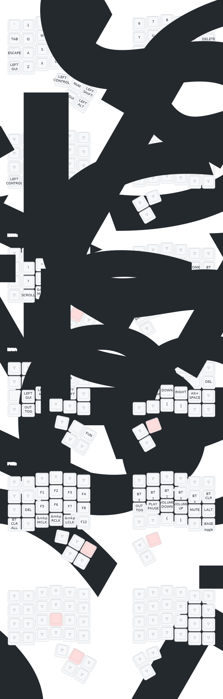

# Charybdis Mini ZMK Configuration

This repository contains the ZMK firmware configuration for the Charybdis Mini Wireless keyboard.

It features a robust local build environment running the exact same Docker image as the GitHub Actions CI, ensuring bit-for-bit parity without requiring a local Zephyr SDK installation on your host system.

---

## Keymap



> [!NOTE]
> This diagram is generated automatically by [keymap-drawer](https://github.com/caksoylar/keymap-drawer) on every push that changes the keymap (see `.github/workflows/draw-keymap.yml`). The physical layout comes from `config/info.json` — the same file the [keymap-editor](https://nickcoutsos.github.io/keymap-editor/) web GUI reads — so the picture always matches what you edit. The `master` and `charybdis-full` branches each render their own diagram.

### Layers

| # | Name | Reached by | Purpose |
|---|------|-----------|---------|
| 0 | `BASE` | default | Alphas; thumbs = Ctrl / `mo NUM` / Shift ∣ Space / `lt NAV`-Backspace |
| 1 | `SwapCtrlGui` | `ToggleMacWin` combo (`tog 1`) | Swaps Ctrl↔GUI for macOS vs Windows muscle memory |
| 2 | `NUM` | hold `mo 2` (left thumb) | Numpad, symbols, mouse clicks, `bt BT_SEL` |
| 3 | `NAV` | hold `lt 3` (right thumb) | Arrows, F1–F5, `studio_unlock`, `bootloader`, output toggle |
| 4 | `FUN` | hold `mo 4` (from NAV) | F1–F12, Bluetooth select/clear, media, output toggle |
| 5 | `SCROLL` | hold `mo 5` (from NUM) | Trackball XY → scroll wheel via input processors |

### Combos

| Keys | Output |
|------|--------|
| `16 15` | Delete |
| `16 14` | Backspace |
| `16 19` | Enter |
| `36 22` | Emoji picker (`LG(;)`) |
| `27 28` / `32 31` | `[` / `]` |
| `36 39` | Sticky Ctrl+Shift (base) / Cmd+Shift (layer 1) |
| `24 36` | Toggle Mac/Win (`tog 1`) |
| `7 8 9 10` | Clear current Bluetooth bond (`bt BT_CLR`) |
| `28 27 26 25` / `31 32 33 34` | Bootloader (left / right half) |

---

## Prerequisites

Before building locally, ensure you have the following installed on your host system:
* **Docker Desktop**: Running and active.
* **Make** & **Bash**: Standard on macOS and Linux.
* **rsync**: Used to safely sync the config files to the build staging directory.

---

## Local Build Instructions

Follow these commands to configure, build, and maintain your local firmware:

### 1. First-Time Initialization
Run the initialization target to set up the persistent Docker volume, pull the compilation image, and perform the initial `west init`, `west update`, and CMake package registration:
```bash
make init
```
> [!NOTE]
> The initial `west update` download is around 1–2 GB. This may take a few minutes depending on your network connection.

### 2. Build All Firmware
To compile the left half, right half (with ZMK Studio and RPC support), and the settings reset flasher in one command, run:
```bash
make build
```

### 3. Build Specific Targets
You can also compile individual targets to save time:
* **Left Half Only**:
  ```bash
  make left
  ```
* **Right Half Only** (Includes ZMK Studio support):
  ```bash
  make right
  ```
* **Settings Reset Flasher**:
  ```bash
  make reset
  ```

### 4. Cache & Clean Targets
* **Clear Build Caches**: Delete intermediate build caches within the Docker volume while leaving ZMK and Zephyr modules intact:
  ```bash
  make pristine
  ```
* **Full Teardown**: Remove the Docker volume, sentinel files, and all staging directories to start completely fresh:
  ```bash
  make clean
  ```

---

## Flashing Firmware

After `make build`, the `.uf2` binaries land in `firmware/`. Each half is a `nice_nano_v2` and flashes over USB via the UF2 bootloader.

### 1. Enter the bootloader
On the half you want to flash, do one of:
* **Double-tap the on-board reset button** (fastest), or
* **Hold the bootloader combo** from the running firmware:
  * Left half → keys `28 27 26 25` (`Reset_L`)
  * Right half → keys `31 32 33 34` (`Reset_R`)

The board mounts as a USB drive named **`NICE~NANO`**.

### 2. Copy the matching `.uf2`
Drag the correct file onto the `NICE~NANO` volume:

| File | Flash to |
|------|----------|
| `charybdis_left-nice_nano_v2-zmk.uf2` | Left half |
| `charybdis_right-nice_nano_v2-zmk.uf2` | Right half (central + ZMK Studio) |
| `settings_reset-nice_nano_v2-zmk.uf2` | **Both** halves — see below |

The board reboots automatically on copy. macOS may show a "disk not ejected properly" warning — that is expected, not an error.

### 3. When pairing breaks (`settings_reset`)
If the halves won't talk to each other, or the keyboard won't reconnect to a host, wipe the stored BLE bonds and settings:

1. Flash `settings_reset-...uf2` to **both** halves.
2. Re-flash `charybdis_left` and `charybdis_right` to each side.
3. The halves re-pair automatically; re-pair to the host on a free profile.

Within normal firmware you can also clear bonds without reflashing: the `BT_Clear` combo (`7 8 9 10`) clears the current profile, and `&bt BT_CLR_ALL` on the `FUN` layer clears all profiles.

---

## Trackball Tuning

The PMW3610 trackball behaviour is configured by the input-processor chain in [`config/charybdis.keymap`](config/charybdis.keymap) under `trackball_listener`:

* **Noise gate / report rate** — `zip_ble_report_rate_limit <ms>` is placed **first** in the chain and caps how often sensor events pass through. The long comment block at the top of `charybdis.keymap` documents the trade-offs (8 ms ≈ 125 Hz minimal filtering → 33 ms ≈ 30 Hz aggressive). Raise it if you see jitter; lower it for snappier fast flicks.
* **Pointer speed** — `zip_xy_scaler 1 2` scales raw movement (numerator/denominator). Increase the numerator for a faster cursor.
* **Scroll mode** — the `SCROLL` layer (5) swaps in `zip_xy_to_scroll_mapper` so the ball drives the scroll wheel instead of the cursor.

---

## Configuring Build Output Locations

The build script saves compiled `.uf2` firmware files to two locations. You can configure these target directories directly in the `Makefile` under the **Paths** section (around lines 48-54):

```makefile
# Staging dirs on the host: space-free, Docker bind-mount safe
CONFIG_STAGE   := $(HOME)/Docker/zmk-config
FIRMWARE_STAGE := $(HOME)/Docker/zmk-fw

# Final .uf2 output directory inside the repo (gitignored)
FIRMWARE_DIR   := $(REPO_ROOT)/firmware
```

### 1. Final Repository Output (`FIRMWARE_DIR`)
This is the directory in your local git repository where the final `.uf2` binaries are copied.
* **Default**: `$(REPO_ROOT)/firmware` (a gitignored folder named `firmware` at the root of this repository).
* **To change it**: Update the `FIRMWARE_DIR` variable to any absolute or relative path on your host machine.

### 2. Docker Staging Directory (`FIRMWARE_STAGE`)
Due to file I/O limitations and path spaces on macOS (especially inside iCloud/spaced directories like `Mobile Documents`), the Docker container writes outputs to a space-free staging directory inside your user's home directory.
* **Default**: `$(HOME)/Docker/zmk-fw` (resolves to `~/Docker/zmk-fw`).
* **To change it**: Update the `FIRMWARE_STAGE` variable to a space-free, Docker bind-mount safe directory on your local machine.

---

## Introspecting Firmware Binaries

To view the size and timestamp of the compiled `.uf2` binaries in your local output folder, run:
```bash
make firmware
```
